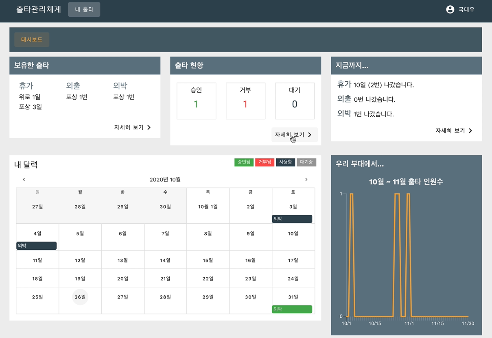
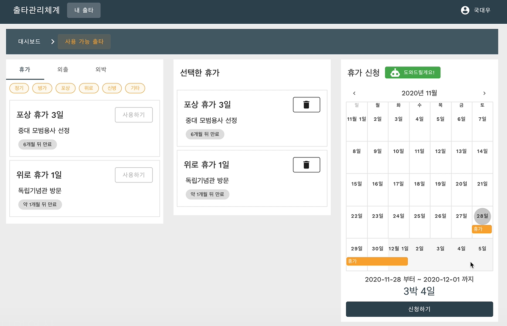
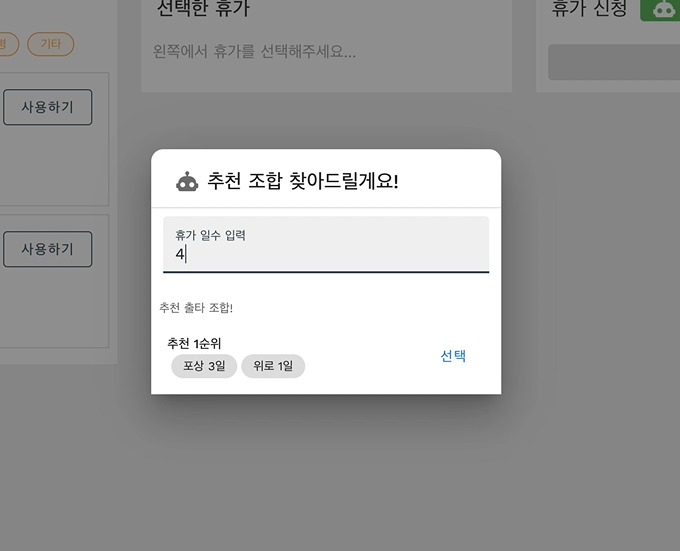
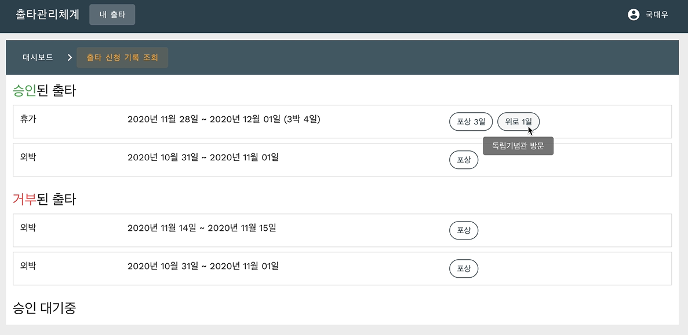
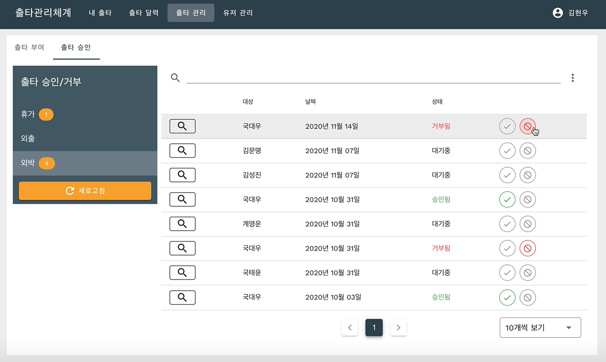
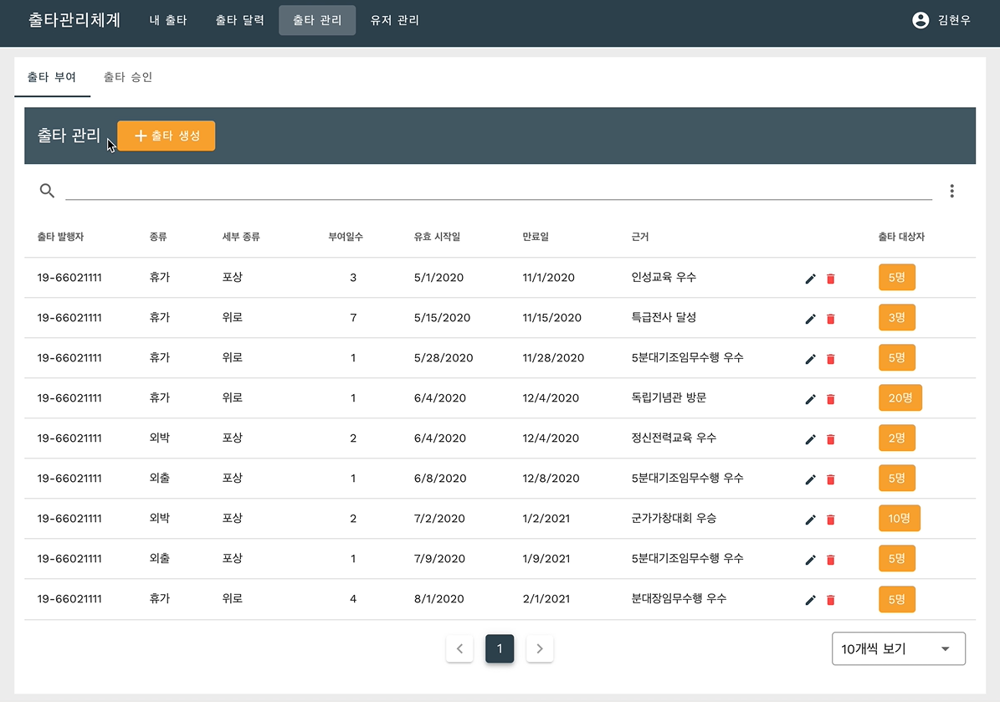
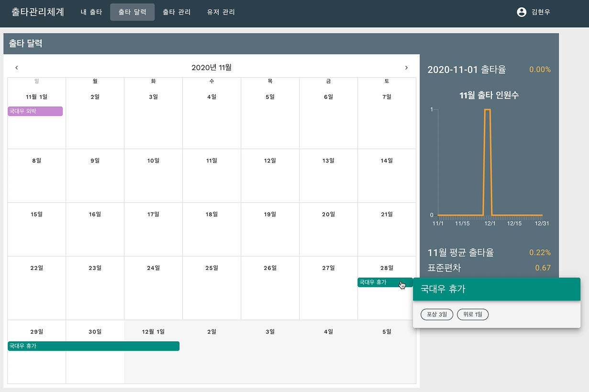

<p align="center"></p>
<p align="center">


<a href="LICENSE.md"></a>
</p>

출타 신청시의 *소통의 어려움*과 *작업의 불편함*을 해결하는 **자동화된 시스템**

## 시연영상

[](https://youtu.be/Hc-uen8y0mc)

## 왜 만들었나요?

#### 용사가 보유한 출타 확인불가

본인이 휴가가 정확히 얼마나 있는지 모릅니다!

#### 행정계원의 단순 노동

2020년에 손으로 써서 신청하고 엑셀로 정리하여 종합합니다. 행정계원 1명이 중대용사 100명분을!

#### 출타 승인 여부를 확인할 수 없음

신청한 휴가가 혹시 잘렸는지 모두가 하루 세네번씩 행정계원에게 물어봅니다! 계원은 괴롭습니다!

## 뭐가 좋나요?

#### 엑셀 노가다는 그만

출타 부여, 신청, 승인 등 모든 작업이 자동화된 체계 내에서 동작합니다!

#### 계원 찾아 삼만리도 그만

로그인 한 번에 보유한 출타, 출타 신청 현황, 승인 여부 등 모든 정보를 확인 가능합니다!

#### 언제 어디서나 나의 출타계획 도우미와 함께

휴가조합 추천 AI와 출타 통계 기능을 통해 많은 출타 고민들을 용사 대신 해줍니다!

# 기능 설계

**[Oven](https://ovenapp.io/view/PCf6ZCxAgq8ROY5VMIlacoo4sQgquEBH/Pnctr)**

## 유저 페이지 구성

### 대시보드



본인의 출타에 관한 모든 정보가 요약되어 한 화면에 표시됩니다. 대시보드는 크게 5개 기능으로 구성되어 있습니다.

<table>
   <tbody>
<tr>
<td>보유한 출타 조회</td><td>본인의 잔여 출타들이 종류별로 분류되어 보유 출타 일수가 표시됩니다.</td>
</tr>
<tr>
<td>출타신청 현황 조회</td><td>본인이 신청한 출타들의 상태(승인/거부/대기)가 상태별로 분류되어 그 개수가 표시됩니다.</td>
</tr>
<tr>
<td>출타 히스토리 조회</td><td>본인이 과거에 나간 모든 출타들의 목록이 요약되어 표시됩니다.</td>
</tr>
<tr>
<td>내 출타달력 조회</td><td>본인이 과거에 나간 출타들, 신청 후 승인된 그리고 대기중인 예정된 출타들이 달력에 표시됩니다.</td>
</tr>
<tr>
<td>월별 출타율 그래프 조회</td><td>내 달력과 연동되어, 최근 2개월의 날짜별 출타율 정보가 꺾은선 그래프로 표시됩니다. 용사들이 출타신청시 언제 출타를 나갈 수 있을지 예측할 때 유용합니다.</td>
</tr>
   </tbody>
</table>

### 출타신청



대시보드의 '보유한 출타' 영역 우측 하단의 자세히 보기 버튼을 클릭하면 표시됩니다.

사용하려는 출타들을 선택하고, 달력에서 출발일을 선택하고 신청하기 버튼을 클릭하면 출타가 신청됩니다.

#### 기능

<table>
   <tbody>
<tr><td>보유 출타를 모두 조회</td></tr>
<tr><td>보유 출타를 종류(정기, 포상, 청원 등)로 필터링하여 조회</td></tr>
<tr><td>휴가, 외출, 외박 신청</td></tr>
<tr><td>AI가 추천해주는 휴가 조합</td></tr>
   </tbody>
</table>



만료일과 출타길이를 기반으로 조합별 점수를 매겨 최상의 휴가 조합 3개를 추천해주는 **휴가 추천 시스템**을 이용해 출타일수만 결정하면 더 이상의 고민 없이 즉시 신청 가능합니다.

### 출타 현황



## 관리자 페이지 구성

### 출타신청 현황 조회



대시보드의 '출타신청 현황' 영역 우측 하단의 자세히 보기 버튼을 클릭하면 표시됩니다.

본인이 신청한 출타들의 상태가 상태별로(승인/거부/대기) 분류되어 조회됩니다.

#### 기능

<table>
   <tbody>
<tr><td>신청한 모든 출타의 상세 정보를 조회</td></tr>
<tr><td>승인된, 거부된, 승인대기중인 출타들의 목록을 각각 조회</td></tr>
   </tbody>
</table>

### 출타 부여



### 출타 달력



# 컴퓨터 구성 / 필수 조건 안내 (Prerequisites)

#### 브라우저 권장 사항

- ECMAScript 6 지원 브라우저 사용
- 권장: Google Chrome 버젼 77 이상

#### Backend 서버 권장 사항

- Node.js v12.13.0 이상

# 주요 기술 스택

### Backend Server

- [Node.js](https://nodejs.org)
- [Express](https://expressjs.com/)
- [MongoDB](https://www.mongodb.com/)
- [Passport.js](http://www.passportjs.org/)

### Frontend

- [Vue.js](https://vuejs.org/)
- [Vuetify.js](https://vuetifyjs.com/)
- [Webpack](https://webpack.js.org/)
- [Chart.js](https://www.chartjs.org/)

# 프로젝트 구조

```
├── backend                   // 백엔드 디렉터리
│   ├── app
│   │   ├── controllers       // route 구현 코드
│   │   ├── middleware        // route helper 코드
│   │   ├── models            // DB 모델 정의
│   │   └── routes            // route 정의
│   ├── config
│   ├── data                  // 초기 설정된
│   ├── public                // 빌드된 frontend 위치
│   ├── test
│   └── views
├── frontend                  // 프론트엔드 디렉터리
│   ├── public
│   └── src
│       ├── assets
│       ├── components        // 컴포넌트
│       │   ├── core          // 공통으로 사용되는 컴포넌트
│       │   └── myleave       // 내 출타 페이지의 컴포넌트
│       ├── plugins
│       ├── router
│       │   └── routes        // 페이지 route 정의
│       ├── services          // API helper 코드
│       ├── store             // Vuex 상태 코드
│       │   └── modules
│       ├── utils
│       └── views             // 페이지
│           └── MyLeave       // 내 출타 페이지
```

# 설치 안내

1. `node.js`, `yarn`, `docker`, `git` 를 설치
2. `$ git clone https://github.com/osamhack2020/WEB_LeaveOutSystem_Div-7` 명령으로 리포지토리를 클론
3. `/utils` 디렉토리에서 `$ . setup.sh` 명령을 실행
4. `backend` 디렉토리의 .env 파일의 설정을 변경

자세한 정보는 [Startup Guide](documentation/startup_guide.md) 문서를 참고하세요.

# 프로젝트 사용법

#### Backend 실행

```bash
$ cd backend
$ yarn dev
```

#### Frontend 실행

```bash
$ cd frontend
$ yarn serve
```

# 팀 정보

박건영 (tekiter8@gmail.com)<br>
<a href="https://github.com/Tekiter"></a>

백도원 (bkdo1006@naver.com)<br>
<a href="https://github.com/ask-to-answer"></a>

# 저작권 및 사용권 정보 (Copyleft / End User License)

<a href="LICENSE.md"></a>
